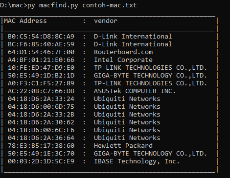
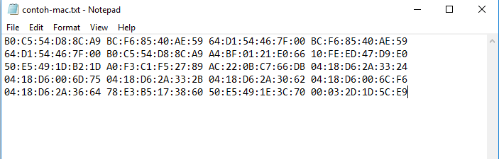

# Bulk mac vendor lookup

Kode ini ditulis dengan python 3.6
Pengguna di harapkan terkoneksi internet dikarnakan tool ini menggunakan api dari : 
https://macvendors.co/api/

Cara penggunaannya seperti di gambar berikut: 

Penulisan mac address harus dengan spasi untuk pemisah bukan dengan enter: 
